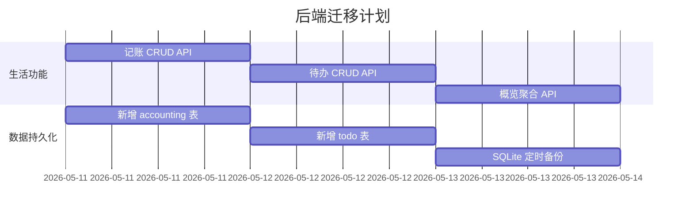

# 技术架构评估报告：生活助手主框架方案

**评估人**：辛如音（技术专家）
**日期**：2026-05-10
**版本**：v1.0

---

## 1. 现有项目结构总览

### 前端（uni-app + Vue3 + TypeScript + Pinia + uView UI 2.x）

```
src/
├── pages/
│   ├── login/      登录页
│   ├── dashboard/  统计看板（Token统计、趋势）
│   ├── kanban/     任务看板（~1129行，功能完整）
│   ├── agents/     Agent管理
│   ├── repo/       Git仓库信息
│   └── life/       生活模块（占位，仅125行骨架）
├── store/
│   ├── user.ts     用户认证状态
│   ├── kanban.ts   看板数据（~241行）
│   ├── stats.ts    统计看板数据（~229行）
│   └── agents.ts   Agent状态（~86行）
├── utils/
│   ├── request.ts  API请求封装（uni.request）
│   └── storage.ts  本地存储
├── pages.json      路由+TabBar配置（5个Tab已满）
├── App.vue         根组件（仅router-view）
└── main.ts         入口（createSSRApp + Pinia）
```

**TabBar 现状**（已用满5个上限）：

| 位置 | Tab名称 | 页面 |
|------|---------|------|
| 1 | 统计 | dashboard |
| 2 | 任务 | kanban |
| 3 | Agent | agents |
| 4 | 仓库 | repo |
| 5 | 生活 | life |

### 后端（Express.js BFF + SQLite + PostgreSQL）

```
backend/
├── server.js             主入口（挂载所有路由）
├── config.js             配置（SQLite路径、PG连接、认证等）
├── routes/
│   ├── auth.js           认证路由
│   ├── tokens.js         Token统计
│   ├── kanban.js         看板任务CRUD
│   ├── agents.js         Agent管理
│   ├── repos.js          Git仓库状态
│   ├── milestone.js      里程碑
│   ├── cronjobs.js       Cronjob管理
│   ├── skills.js         Skill管理
│   └── life.js           生活助手路由（已实现：概览、状态、功能列表、执行历史）
├── services/
│   ├── sqlite.js         SQLite封装（WASM驱动，256行）
│   ├── postgres.js       PostgreSQL连接池
│   ├── litellmApi.js     LiteLLM API客户端
│   └── gitRepo.js        Git仓库同步
└── ecosystem.config.js   PM2配置
```

**数据流**：
- SQLite (`/home/agentuser/.hermes/kanban.db`)：看板任务数据
- PostgreSQL (`litellm` 库)：Token使用统计、模型健康状态
- 文件系统 (`~/.hermes/skills/`)：生活助手技能扫描

---

## 2. 各维度详细分析

### 2.1 uni-app 作为主框架的可行性

#### ✅ 优势
1. **现有代码可直接复用** — 无需重写任何前端页面，迁移成本最低
2. **跨平台能力已就绪** — `manifest.json` 已配置 H5、App、微信小程序等多端
3. **Vue3 + Pinia 生态成熟** — 模块化能力足够，`store/` 目录天然支持按领域拆分
4. **uView UI 2.x** — 提供丰富的组件库（表单、弹窗、列表等），适合生活类功能开发
5. **H5 端已完美运行** — 老大用手机浏览器访问完全 OK

#### ⚠️ 核心问题：TabBar 5个Tab上限

**这是最大的架构约束。** 当前5个Tab已用满。新架构要求"生活助手作为主框架"，意味着：

- 生活助手内部需要多个子功能：记账、待办、日程、笔记、设置等
- 看板、统计、Agent、仓库作为"附属模块"也需要可访问

**解决方案（3选1）：**

| 方案 | 可行性 | 说明 |
|------|--------|------|
| **A. 自定义底部导航替代 TabBar** | ✅ **推荐** | 放弃 uni-app 原生 TabBar，在 App.vue 中用自定义组件实现底部导航栏，不受5个限制 |
| **B. 抽屉/侧边栏导航** | ✅ 可行 | 主界面用侧边栏容纳所有模块入口，底部仅保留"首页"和"更多" |
| **C. 顶部 Tab + 二级导航** | ✅ 可行 | 顶部主导航用生活助手，底部二级导航切换附属模块 |

**推荐方案 A 的详细设计：**

uni-app 完全支持自定义导航栏：
- 在 `App.vue` 中渲染自定义 `<tab-bar>` 组件
- 通过 `v-if` 或 `<component :is>` 动态切换页面
- 导航项数量无限制，可支持分组、折叠等复杂交互
- 样式完全可控（图标动效、徽标、渐变等）
- 页面切换使用 `v-show` 实现 SPA 式切换（保留状态）

```vue
<!-- 伪代码示意 -->
<template>
  <view class="app-container">
    <!-- 页面容器 -->
    <view v-show="activeTab === 'home'"><LifeHome /></view>
    <view v-show="activeTab === 'accounting'"><Accounting /></view>
    <view v-show="activeTab === 'kanban'"><Kanban /></view>
    <view v-show="activeTab === 'dashboard'"><Dashboard /></view>
    <!-- 自定义底部导航栏 -->
    <CustomTabBar :items="navItems" :active="activeTab" @change="activeTab=$event" />
  </view>
</template>
```

#### ✅ uni-app 的页面路由和模块化能力

- **路由**：uni-app 支持 `uni.navigateTo` / `uni.switchTab` / `uni.reLaunch`，配合自定义导航可以按需跳转
- **模块化**：Vue3 组件系统 + Pinia Store + TypeScript，完全能支撑"主框架+附属模块"架构
- **分包加载**：uni-app 支持 `subPackages` 配置，附属模块可以分包加载优化性能
- **条件编译**：`#ifdef H5` / `#ifdef APP-PLUS` 等条件编译，跨平台差异化开发

#### ✅ 跨平台能力

- **H5**：✅ 当前主力平台，运行完美
- **App**：✅ uni-app 支持打包成 Android/iOS 原生 App（通过 HBuilderX 或 CLI）
- **小程序**：✅ 支持微信/支付宝/抖音等（配置已就绪，`mp-weixin` 已配置）
- **鸿蒙**：✅ `uni-app-harmony` 已依赖

**结论：跨平台能力完全匹配需求。**

---

### 2.2 Express BFF 作为后端的可行性

#### ✅ 优势

1. **轻量、零配置** — 单进程部署，PM2 管理，运行稳定
2. **已有完整路由体系** — 9个路由模块覆盖所有现有功能
3. **SQLite + PostgreSQL 双数据源** — 看板数据走 SQLite，统计走 PG
4. **life.js 已实现基础框架** — 功能扫描、状态查询、执行历史等

#### ⚠️ 潜在问题

| 问题 | 严重程度 | 说明 | 对策 |
|------|----------|------|------|
| **单进程瓶颈** | 🟡 低 | 单用户场景下，Express 单进程足够应对 | 无需拆分微服务 |
| **SQLite 并发写入** | 🟡 低 | sql.js 是 WASM 同步版，写操作会阻塞 | 单用户场景几乎无并发 |
| **SQLite 持久化** | 🟢 无 | `saveDb()` 已有完整实现 | 无需改动 |
| **路由膨胀** | 🟡 中 | 随着生活功能增多，routes/ 目录会变胖 | 按领域拆分到子目录即可 |
| **无数据库迁移** | 🟡 低 | 当前 SQLite 无 migration 机制 | 新增功能时手动建表即可 |

#### 是否需要拆分微服务？

**不需要。** 理由：
1. **单用户场景** — 不存在多租户、高并发问题
2. **BFF 模式** — Express 作为 BFF（Backend For Frontend），职责单一
3. **已有成熟架构** — 所有路由挂载在同一个 Express 实例上，内部按文件拆分
4. **未来扩展** — 如果生活功能需要独立部署，可以随时将 `life.js` 抽离为独立服务（但当前无此必要）

#### 数据库策略：SQLite 够用吗？

| 维度 | 评估 |
|------|------|
| **数据量** | 单用户，看板任务几百条，记账记录几千条/年 — ✅ 足够 |
| **并发** | 单用户，几乎无并发 — ✅ 足够 |
| **复杂查询** | 看板过滤、记账统计等 — ✅ SQLite 支持窗口函数、CTE |
| **数据安全** | WASM sql.js 写入文件，有 `saveDb()` 机制 — ⚠️ 建议增加定时备份 |
| **迁移** | 未来可无缝迁移到 PostgreSQL — 只需替换 `services/sqlite.js` |

**结论：SQLite 在当前单用户场景下完全够用。** 建议：
- 定期备份 `kanban.db`
- 记账等新功能可以复用同一个 SQLite 文件（加新表）
- 如果未来需要多用户，可平滑迁移到 PostgreSQL

---

### 2.3 备选框架对比

| 维度 | uni-app (现状) | Vue3 + Vite 独立前端 | React / Next.js | Flutter |
|------|---------------|---------------------|-----------------|---------|
| **学习成本** | 🟢 零（现有代码） | 🟢 低（Vue3 已用） | 🟡 中（需学 React） | 🔴 高（Dart + 新生态） |
| **H5 支持** | 🟢 优秀 | 🟢 优秀 | 🟢 优秀 | 🟡 一般（Web 不是主打） |
| **App 打包** | 🟢 uni-app 原生打包 | 🔴 需另选方案（Capacitor/WebView） | 🔴 需另选方案（React Native / Tauri） | 🟢 原生 App 体验最佳 |
| **小程序支持** | 🟢 原生支持 | 🔴 不支持 | 🔴 不支持（需 Taro） | 🔴 不支持 |
| **TabBar 限制** | ⚠️ 原生5个，可自定义绕过 | 🟢 无限制 | 🟢 无限制 | 🟢 无限制 |
| **现有代码复用** | 🟢 100% 复用 | 🟡 组件级复用（Vue 语法一致） | 🔴 需重写（React 语法不同） | 🔴 需完全重写 |
| **生态丰富度** | 🟡 uni-app 生态中等 | 🟢 Vue3 生态丰富 | 🟢 React 生态最丰富 | 🟡 Dart 生态中等 |
| **包体积** | 🟡 中（含 uni 运行时） | 🟢 小（纯 Web） | 🟢 小（纯 Web） | 🔴 较大 |
| **SEO** | 🔴 不支持 SSR | 🟡 需额外配置 Nuxt | 🟢 Next.js SSR 原生支持 | 🔴 不支持 |
| **开发体验** | 🟡 一般（HBuilderX 依赖重） | 🟢 优秀（Vite HMR 极快） | 🟢 优秀（Vite/Next.js） | 🟡 一般（Dart 工具链重） |
| **适合本项目程度** | **🟢 最合适** | 🟡 可行但需放弃跨平台 | 🔴 过度设计 | 🔴 过度设计 |

#### 为什么不推荐换框架

1. **换 React/Next.js**：现有 ~3000 行前端代码需要全部重写，成本太高，收益几乎为零。SSR 对本项目无意义（单用户私用 Dashboard）。
2. **换 Flutter**：当前主力是 H5（手机浏览器），Flutter Web 体验不如原生 Web。如果未来打包 App，uni-app 也能做到。
3. **换 Vue3 + Vite 独立前端**：失去跨平台能力（小程序、App 打包），而 uni-app 底层就是 Vite + Vue3，本质相同但多了跨平台支持。

**uni-app 最大的优势是「不动代码」**——现有看板、统计、Agent、仓库页面全部可以保留，只需调整导航架构。

---

### 2.4 迁移成本评估

#### 方案一：继续用 uni-app（推荐）

| 改动项 | 工作量 | 说明 |
|--------|--------|------|
| 自定义导航组件 | ~2小时 | 写一个 `CustomTabBar.vue` 替代原生 TabBar |
| App.vue 重构 | ~1小时 | 从纯 `router-view` 改为多页面容器 + 自定义导航 |
| pages.json 调整 | ~0.5小时 | 移除 tabBar 配置，保留页面路由 |
| 生活助手首页 | ~4小时 | 开发功能入口网格、快捷操作、概览卡片 |
| 记账功能 | ~8小时 | 新增 `pages/life/accounting/` 子页面 + store |
| 待办功能 | ~4小时 | 可复用看板数据或新建轻量待办 |
| 后端新增路由 | ~4小时 | 新增生活功能对应的 API 路由 |
| **总计** | **~23.5小时** | 约3个工作日 |

**现有代码改动量**：几乎为 0。kanban/dashboard/agents/repo 页面完全不动。

#### 方案二：换 Vue3 + Vite 独立前端

| 改动项 | 工作量 | 说明 |
|--------|--------|------|
| 新建项目脚手架 | ~1小时 | Vite + Vue3 + TS + Pinia |
| 看板页面重写 | ~8小时 | 从 uni-app 语法迁移到标准 Vue3（view→div, uni.xxx→axios 等） |
| 统计页面重写 | ~6小时 | 同上，uCharts 替换方案 |
| Agent页面重写 | ~4小时 | 同上 |
| 仓库页面重写 | ~3小时 | 同上 |
| 生活助手首页 | ~4小时 | 新建 |
| 自定义导航 | ~2小时 | 新建 |
| 认证/请求工具 | ~2小时 | 重写 request.ts |
| 跨平台能力丧失 | ❌ | 失去小程序和 App 打包能力 |
| **总计** | **~30小时** | 约4个工作日，且功能有退化 |

#### 方案三：换 React/Next.js / Flutter

| 框架 | 工作量 | 评估 |
|------|--------|------|
| React/Next.js | ~40小时（5天） | 全部重写，且 SSR 对本项目无意义 |
| Flutter | ~60小时（8天） | 全部重写，H5 体验降级 |

---

## 3. 推荐方案

### 🏆 强烈推荐：继续使用 uni-app + Express BFF

**核心理由：**

1. **零代码重写成本** — 现有看板、统计、Agent、仓库页面完全保留
2. **只需调整导航架构** — 用自定义底部导航替代原生 TabBar，解决5个Tab上限
3. **跨平台能力保留** — H5 + 小程序 + App 三端支持
4. **Express BFF 足够支撑** — 单用户场景下，SQLite 够用，无需微服务
5. **迁移风险最低** — 渐进式改造，先搭生活助手框架，再逐个迁移附属功能

---

## 4. 新架构设计方案

### 4.1 导航架构

```
┌─────────────────────────────────┐
│         顶部状态栏               │
│  [Hermes Logo] [搜索] [设置]    │
├─────────────────────────────────┤
│                                 │
│      页面容器（动态切换）         │
│                                 │
│  ┌───────────────────────────┐  │
│  │  生活助手首页（默认）       │  │
│  │  ├─ 快捷操作（记账/待办/..)│  │
│  │  ├─ 概览卡片（今日统计）    │  │
│  │  └─ 功能入口网格           │  │
│  └───────────────────────────┘  │
│                                 │
│  或                             │
│                                 │
│  ┌───────────────────────────┐  │
│  │  看板（现有页面）          │  │
│  │  统计（现有页面）          │  │
│  │  Agent（现有页面）         │  │
│  │  仓库（现有页面）          │  │
│  └───────────────────────────┘  │
│                                 │
├─────────────────────────────────┤
│  🏠  📊  📋  🤖  📁  ⚙️      │
│  首页 统计 看板 Agent 仓库 设置 │
│      └── 自定义底部导航栏 ──┘   │
└─────────────────────────────────┘
```

**导航项设计**（不受5个限制）：

| 图标 | 名称 | 类型 | 说明 |
|------|------|------|------|
| 🏠 | 首页 | 主模块 | 生活助手首页（功能入口网格） |
| 📊 | 统计 | 附属 | 现有 dashboard 页面 |
| 📋 | 看板 | 附属 | 现有 kanban 页面 |
| 🤖 | Agent | 附属 | 现有 agents 页面 |
| 📁 | 仓库 | 附属 | 现有 repo 页面 |
| ⚙️ | 设置 | 全局 | 系统设置、生活助手配置 |

> 未来还可增加：📒 记账、📅 日程、📝 笔记等

### 4.2 目录结构

```
src/
├── App.vue                    # 重构：多页面容器 + 自定义导航
├── main.ts                    # 不变
├── pages.json                 # 移除 tabBar，保留页面路由
│
├── modules/                   # ★ 新：模块化目录
│   ├── life/                  # 生活助手主模块
│   │   ├── pages/
│   │   │   ├── index.vue      # 生活助手首页（功能入口）
│   │   │   ├── accounting/    # 记账子页面
│   │   │   ├── todo/          # 待办子页面
│   │   │   └── schedule/      # 日程子页面
│   │   ├── components/        # 生活模块通用组件
│   │   └── store/             # 生活模块状态管理
│   │       ├── accounting.ts
│   │       └── todo.ts
│   │
│   ├── kanban/                # ★ 迁移：现有 pages/kanban 移入
│   │   ├── pages/kanban.vue   # 现有看板页面
│   │   ├── components/        # 看板组件
│   │   └── store/kanban.ts    # 现有 store
│   │
│   ├── dashboard/             # ★ 迁移：现有 pages/dashboard 移入
│   │   ├── pages/dashboard.vue
│   │   ├── components/
│   │   └── store/stats.ts
│   │
│   ├── agents/
│   │   ├── pages/agents.vue
│   │   ├── components/
│   │   └── store/agents.ts
│   │
│   └── repo/
│       ├── pages/repo.vue
│       └── components/
│
├── components/                # 全局通用组件
│   ├── CustomTabBar.vue       # ★ 新：自定义底部导航栏
│   ├── TopBar.vue             # ★ 新：顶部状态栏
│   ├── StatCard.vue           # 现有
│   ├── Badge.vue              # 现有
│   └── FilterBar.vue          # 现有
│
├── store/                     # 全局状态
│   ├── user.ts                # 现有
│   └── navigation.ts          # ★ 新：导航状态（当前 tab、历史栈）
│
├── utils/                     # 不变
│   ├── request.ts
│   └── storage.ts
│
├── styles/                    # 不变
│   └── global.scss
│
└── static/                    # 不变
    └── icons/
```

### 4.3 App.vue 新架构伪代码

```vue
<template>
  <view class="app-container">
    <!-- 顶部状态栏 -->
    <TopBar :title="currentNavItem?.label || 'Hermes'" />

    <!-- 页面容器（SPA 式切换，保留状态） -->
    <view class="page-container">
      <LifeHome     v-show="activeTab === 'home'" />
      <Dashboard    v-show="activeTab === 'dashboard'" />
      <Kanban       v-show="activeTab === 'kanban'" />
      <Agents       v-show="activeTab === 'agents'" />
      <Repo         v-show="activeTab === 'repo'" />
      <Settings     v-show="activeTab === 'settings'" />
    </view>

    <!-- 自定义底部导航栏 -->
    <CustomTabBar
      :items="navItems"
      :active="activeTab"
      @change="onTabChange"
    />
  </view>
</template>
```

### 4.4 后端架构调整

后端 **基本不需要改动**。现有路由结构已经按领域划分好了：

```
/api/life/*      → 生活助手（已实现基础框架）
/api/kanban/*    → 看板任务（不动）
/api/tokens/*    → 统计（不动）
/api/agents/*    → Agent（不动）
/api/repos/*     → 仓库（不动）
/api/skills/*    → Skill（不动）
```

**建议新增**：
- `backend/routes/life/` 子目录：按功能拆分（`accounting.js`, `todo.js`）
- `backend/services/life/`：生活功能业务逻辑

---

## 5. 迁移路线图

### 第一阶段：导航重构（1天）

```
Day 1:
├── 上午：创建 CustomTabBar.vue 组件
│   ├── 支持动态导航项列表
│   ├── 图标 + 文字样式
│   ├── 激活态动效
│   └── 角标支持
├── 下午：重构 App.vue
│   ├── 替换原生 TabBar 为自定义导航
│   ├── 页面容器改为 v-show 多页面模式
│   └── 验证所有现有页面功能正常
└── 测试：看板、统计、Agent、仓库页面无变化
```

### 第二阶段：生活助手首页（1天）

```
Day 2:
├── 上午：开发生活助手首页
│   ├── 功能入口网格（9宫格或列表）
│   ├── 快捷操作区（快速记账、快速待办）
│   ├── 今日概览卡片（天气、任务数、账单摘要）
│   └── 后端 /api/life/home 接口（聚合概览数据）
├── 下午：实现记账功能 MVP
│   ├── 前端：记账表单 + 记录列表
│   ├── 后端：/api/life/accounting CRUD
│   └── SQLite：新增 accounting 表
└── 测试：H5 手机端操作流畅
```

### 第三阶段：附属模块迁移（1天）

```
Day 3:
├── 将 pages/ 下的现有页面按模块迁移到 modules/
│   ├── pages/kanban  → modules/kanban/pages/
│   ├── pages/dashboard → modules/dashboard/pages/
│   ├── pages/agents → modules/agents/pages/
│   └── pages/repo   → modules/repo/pages/
├── store 文件对应迁移
└── 验证所有功能正常
```

### 第四阶段：功能完善（持续）

```
Day 4+:
├── 记账功能完善（分类管理、统计图表）
├── 待办功能（可复用看板数据或轻量独立版）
├── 日程/日历功能
├── 系统设置页（主题、数据导出、API配置）
└── App 打包测试（如需要）
```

### 后端并行工作



---

## 6. 风险与应对

| 风险 | 概率 | 影响 | 应对措施 |
|------|------|------|----------|
| 自定义导航在 iOS WebView 有兼容问题 | 🟡 低 | 🟡 中 | 使用 flexbox 布局，测试 Safari 兼容性 |
| 生活助手功能膨胀导致前端包体积过大 | 🟡 中 | 🟡 中 | uni-app 支持分包加载（subPackages） |
| SQLite 数据丢失 | 🟢 极低 | 🔴 高 | 定时备份到 `~/.hermes/backups/` |
| 老大想要更多 Tab 超过预期 | 🟡 中 | 🟢 低 | 自定义导航可动态增减，无限制 |
| 未来需要多用户支持 | 🔴 低 | 🟡 中 | SQLite → PostgreSQL 迁移，API 加用户隔离 |

---

## 7. 最终结论

| 维度 | 评估结果 |
|------|----------|
| **框架选择** | ✅ **继续使用 uni-app + Express BFF** |
| **导航方案** | ✅ 自定义底部导航替代原生 TabBar |
| **后端架构** | ✅ 保持单进程 Express，不拆分微服务 |
| **数据库** | ✅ SQLite 够用，建议增加定时备份 |
| **迁移成本** | 🟢 低（约3天），现有代码几乎不动 |
| **风险等级** | 🟢 低 |
| **推荐指数** | ⭐⭐⭐⭐⭐ |

**一句话总结：现有 uni-app + Express BFF 技术栈完全适合新架构，仅需调整导航方案（自定义底部导航替代原生 TabBar），即可实现「生活助手为主框架，看板等为附属功能」的目标，迁移成本最低、风险最小。**